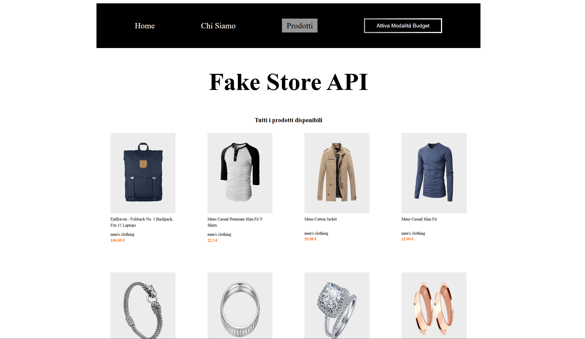
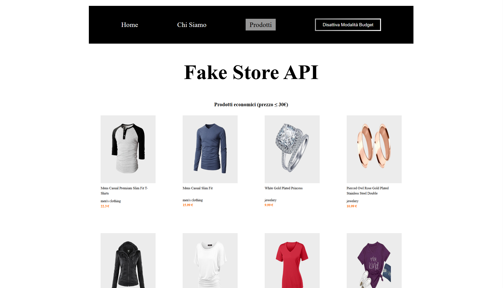

  

<h1 align="center">React Context API</h1>

Estensione del mini e-commerce sviluppato con React Router, che introduce l’utilizzo delle Context API di React per la gestione dello stato globale e il filtraggio dei prodotti in modalità budget.

---

## Collegamento al progetto base

Questo progetto nasce come **estensione del mini e-commerce realizzato con React Router**.

Repository di partenza:  
https://github.com/Damiana-Arangio/react-router.git

---

## Obiettivo

### Milestone 1 – Creazione del Context

- Creare un nuovo context denominato `BudgetContext`
- Gestire uno stato globale `budgetMode` di tipo booleano
- Esporre la funzione per aggiornare lo stato (`setBudgetMode`)
- Wrappare l’intera applicazione tramite `BudgetProvider`

---

### Milestone 2 – Integrazione nella Navbar

- Creare (o riutilizzare) il componente `Navbar`
- Integrare la Navbar all’interno di `App.jsx` o del componente di layout
- Inserire un bottone per attivare/disattivare la modalità budget
- Aggiornare dinamicamente l’etichetta del bottone in base allo stato:
  - *Attiva modalità budget*
  - *Disattiva modalità budget*

---

### Milestone 3 – Filtraggio dei prodotti

- Recuperare il valore di `budgetMode` tramite Context
- Se `budgetMode === true`, mostrare solo i prodotti con `price <= 30`
- In caso contrario, visualizzare l’intera lista dei prodotti

---

## Bonus

- Valutare la centralizzazione dei dati dei prodotti all’interno del Context
- Riutilizzare i dati centralizzati nei componenti che ne hanno necessità

---

## Anteprima – React Context API (modalità budget)

**Modalità budget disattivata**

**Modalità budget attivata**

---

## Tecnologie utilizzate

- React
- React Router DOM
- JavaScript
- Axios
- CSS3
